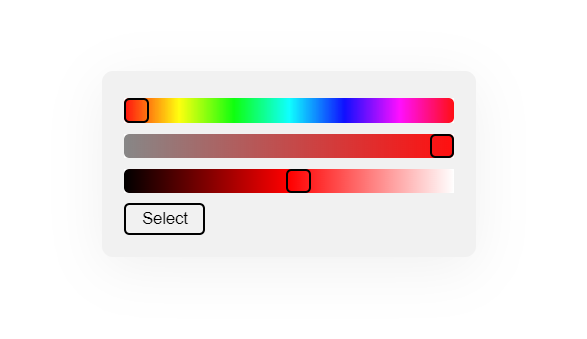

# tint
Simple yet elegant hsl color picker<br>
Requires [qwik.js](https://github.com/prcptn-dsgn/qwik/)



## Importing
Add the following to your html head:<br>

```html
<script src="https://cdn.jsdelivr.net/gh/prcptn-dsgn/qwik/dist/min.js"></script>
<script src="https://cdn.jsdelivr.net/gh/enwash/tint@latest/dist/min.js"></script>
```

For default styling, also add:
```html
<link rel="stylesheet" type="text/css" href="https://cdn.jsdelivr.net/gh/enwash/tint@latest/dist/min.css" />
```

Or style tint yourself - have a look at index.js to view the html source.

Alternatively, you can self-host tint and import the two files in `dist/`.
  
## Usage
To open the tint modal:

```js
tint.open(hslString)
```

If an HSL string is not passed, the picker will default to `hsl(0,100%,50%)`.

When the user has selected a color, a `tintdone` event will be triggered on `window`. Then `tint.get()` can be used to get the selected color:

```js
window.addEventListener('tintdone', e=> {
  tint.close();
  color = tint.get();
  // do something with the selected color
});
```
